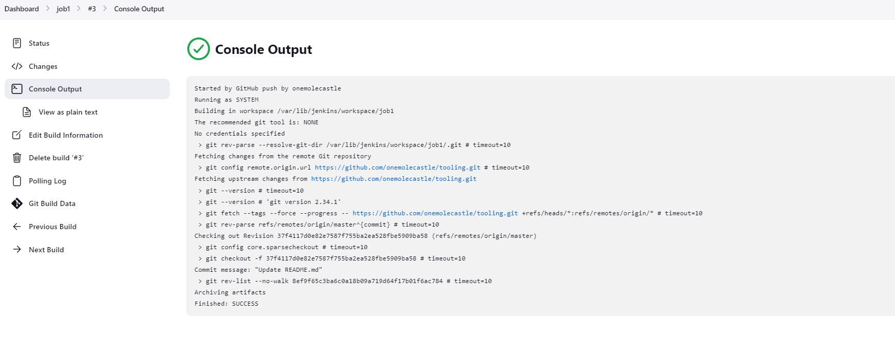

# PROJECT 9 : TOOLING WEBSITE DEPLOYMENT AUTOMATION WITH CONTINUOUS INTEGRATION. 

The aim of this project is to enhance the architecture prepared in Project 8 by adding a Jenkins server, configure a job to automatically deploy source codes changes from Git to NFS server.

## INSTALL AND CONFIGURE JENKINS SERVER

1. Create an AWS EC2 server based on Ubuntu Server 20.04 LTS and name it “Jenkins”

2. Install JDK (since Jenkins is a Java-based application)

$ `sudo apt update`

$ `sudo apt install default-jdk-headless`

3. Install Jenkins

$ `wget -q -O - https://pkg.jenkins.io/debian-stable/jenkins.io.key | sudo apt-key add -`

$ `sudo sh -c 'echo deb https://pkg.jenkins.io/debian-stable binary/ >  /etc/apt/sources.list.d/jenkins.list'`

$ `sudo apt update`

$ `sudo apt-get install jenkins`

Make sure Jenkins is up and running

$ `sudo systemctl status jenkins`

Create a new inbound rule in the EC2 security grouo to allow access to TCP port 8080

4. Perform initial Jenkins setup

From your browser access 

         http://<Jenkins-Server-Public-IP-Address-or-Public-DNS-Name>:8080

You will be prompted to provide a default admin password, run the following command to retrieve the password

$ `sudo cat /var/lib/jenkins/secrets/initialAdminPassword`

Copy and paste the command

Select Install suggested plugins 

## Configure Jenkins to retrieve source codes from GitHub using Webhooks

1. Enable webhooks in your GitHub repository settings

2. Go to Jenkins web console, click “New Item” and create a “Freestyle project”

In configuration of your Jenkins freestyle project choose Git repository and provide there the link to your Tooling GitHub repository so Jenkins could access files in the repository.

Save the configuration and run the build manually by clicking the "Build now" button. If you have configured everything correctly, the build will be successfull and you will see it under #1

3. Click “Configure” your job/project and add these two configurations

 Configure triggering the job from GitHub webhook

Configure “Post-build Actions” to archive all the files – files resulted from a build are called “artifacts”

At this point. if any change is made to the master branch of your Git hub repository, you will see that a new build has been launched automatically (by webhook) and you can see its results – artifacts, saved on Jenkins server

We have now configured an automated Jenkins job that receives files from GitHub by webhook trigger

By default, the artifacts are stored on Jenkins server locally

## CONFIGURE JENKINS TO COPY FILES TO NFS SERVER VIA SSH

### Now we have our artifacts saved locally on Jenkins server, the next step is to copy them to our NFS server to /mnt/apps directory. In order to do this we will need to install a plugin called "Publish Over SSH"

1. On main dashboard select “Manage Jenkins” and choose “Manage Plugins” menu item. On “Available” tab search for “Publish Over SSH” plugin and install it 

### Configure the job/project to copy artifacts over to NFS server

On main dashboard select “Manage Jenkins” and choose “Configure System” menu item.

Scroll down to Publish over SSH plugin configuration section and configure it to be able to connect to your NFS server

1. Provide a private key (content of .pem file that you use to connect to NFS server via SSH/Putty)

2. Arbitrary name

3. Hostname – can be private IP address of your NFS server

4. Username – ec2-user (since NFS server is based on EC2 with RHEL 8)

5. Remote directory – /mnt/apps since our Web Servers use it as a mointing point to retrieve files from the NFS server

Test the configuration and make sure the connection returns Success.

Save the configuration, open your Jenkins job/project configuration page and add another one “Post-build Action”

Configure it to send all files produced by the build into our previously define remote directory. In our case we want to copy all files and directories – so we use **.

Save this configuration and go ahead, change something in README.MD file in your GitHub Tooling repository.

Webhook will trigger a new job and in the “Console Output” of the job you will find something like this:

To make sure that the files in /mnt/apps have been updated – connect via SSH/Putty to your NFS server and check README.MD file

$ `cat /mnt/apps/README.md`

If you see the changes you had previously made in your GitHub – the job works as expected
